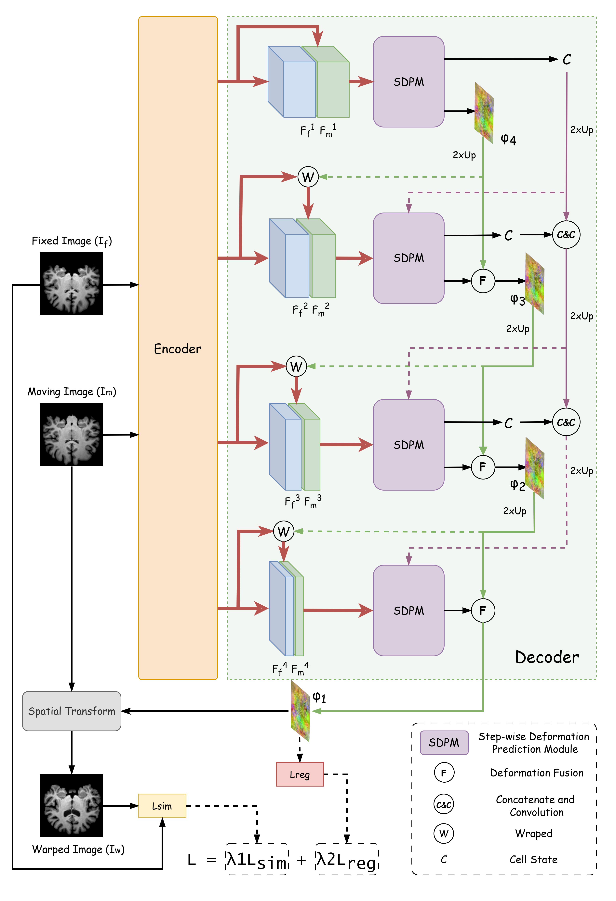
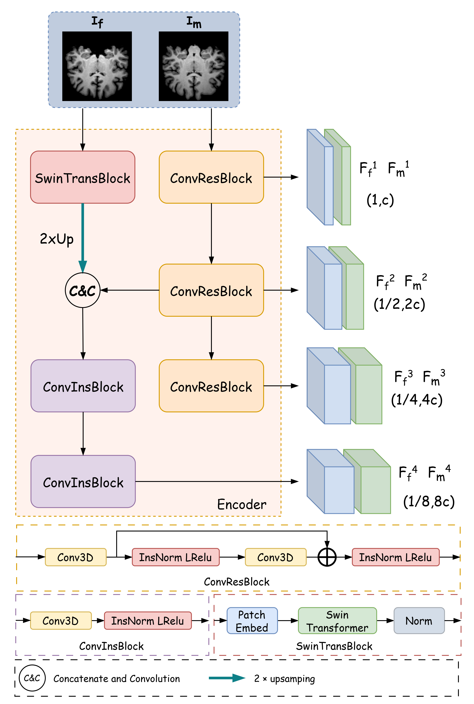
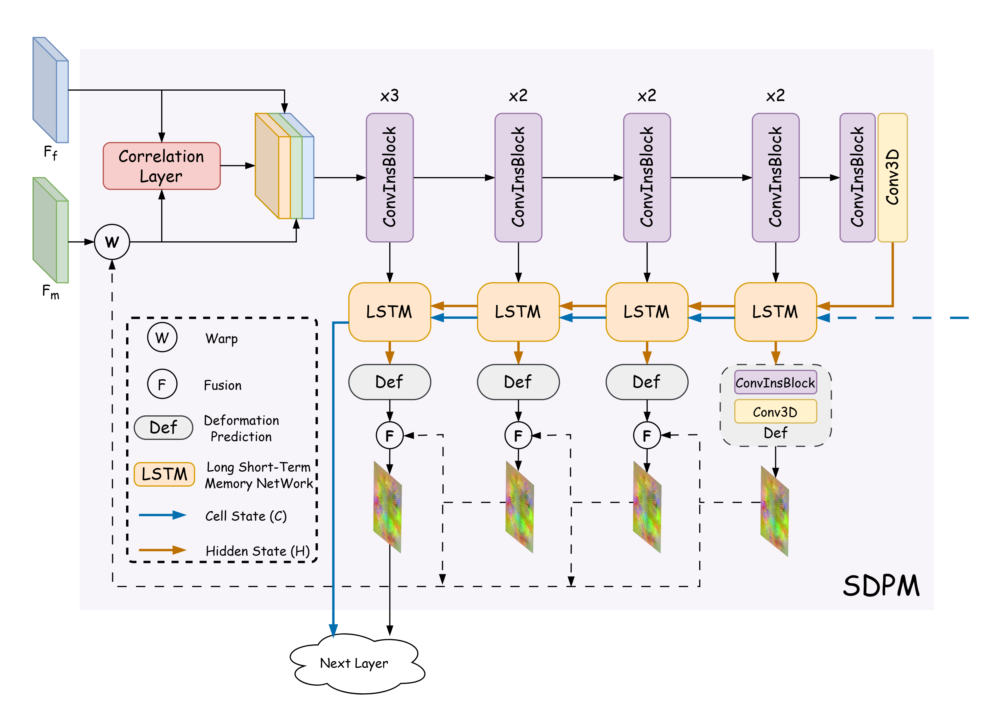
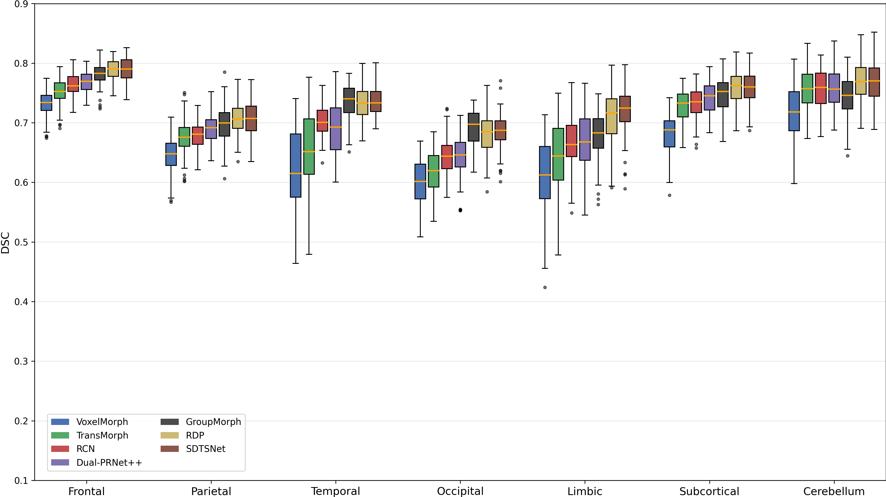
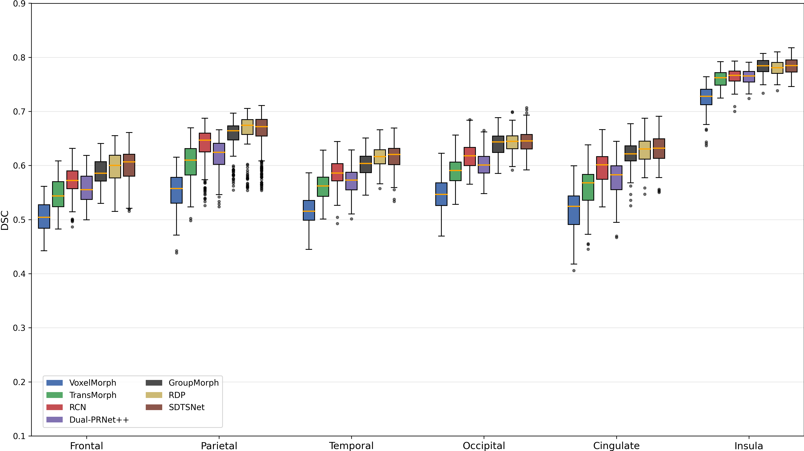

# 基于阶梯式形变预测与时序语义聚合的无监督可变形医学图像配准网络

By Qian Chen

## 介绍
我提出了一种新颖的基于金字塔结构的医学图像可变形配准网络——SDTSNet，其主要亮点为阶梯式形变预测与时序语义聚合机制。在特征提取阶段，SDTSNet采用纯卷积与Transformer混合卷积的双路径架构编码器，旨在捕获兼具丰富局部细节与全局形变信息的特征表示。在解码阶段，SDTSNet引入阶梯式形变预测模块SDPM，SDPM通过在每个尺度层内分解并预测一系列具有不同感受野的形变子场，实现了对多尺度空间信息的细粒度捕获，从而提升了模型对复杂非线性形变的建模能力。此外，为建模非相邻尺度之间的长程依赖关系并最小化信息传递过程中的损失，SDTSNet采用了提出的时序语义聚合机制与全层级信息传递机制，利用LSTM单元在不同尺度之间传递语义信息，强化了不同分辨率层级间的语义交互；同时，通过引入层级残差连接，让高层语义信息可以有效传播到后续所有的尺度层，在最小化信息传递损失的同时，抑制了可能存在的误差累积风险。在三个公开脑部MRI数据集上的大量实验结果表明，所提出的SDTSNet在配准精度、微分同胚性等关键指标上均优于当前主流先进方法，充分验证了其在复杂医学图像配准任务中的有效性与优越性。
#### 概览图

#### 编码器图

#### SDPM图

## 数据集
IXI和LPBA40预处理数据集来自[RDP](https://github.com/ZAX130/RDP)作者提供，感谢该工作所做出的贡献

Mindboggle101数据集获取自[官网](https://osf.io/9ahyp/overview)，感谢该团队所做出的贡献

与TransMorph的做法类似，将数据集打包成.pkl格式，具体可见[TransMorph_on_IXI](https://github.com/junyuchen245/TransMorph_Transformer_for_Medical_Image_Registration/blob/main/IXI/TransMorph_on_IXI.md)

## 基线方法
[RCN](https://github.com/microsoft/Recursive-Cascaded-Networks)、[Dual-PRNet++](https://github.com/kangmiao15/Dual-Stream-PRNet-Plus)的Pytorch实现获取自[ModeT](https://github.com/ZAX130/SmileCode/tree/main)工作所提供的代码

[VoxelMorph](https://github.com/voxelmorph/voxelmorph)的Pytorch实现获取自[TransMorph](https://github.com/junyuchen245/TransMorph_Transformer_for_Medical_Image_Registration)工作所提供的代码

[TransMorph](https://github.com/junyuchen245/TransMorph_Transformer_for_Medical_Image_Registration)、[GroupMorph](https://github.com/TVayne/GroupMorph)和[RDP](https://github.com/ZAX130/RDP)获取自其各自作者提供的官方代码

## 训练和测试
以在LPBA40数据集上训练SDTSNet为例，进入LPBA/SDTSNet文件夹，运行`train.py`文件即可进行训练，运行`infer.py`文件即可进行测试

## 实验结果示例
#### LPBA40数据集箱型图

#### Mindboggle101数据集箱型图

#### 可视化结果
